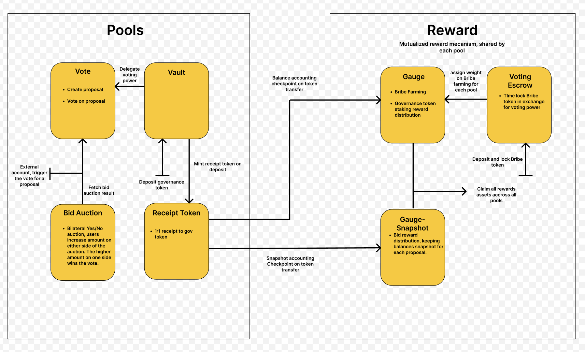

# Twist Protocol

Twist creates DAO infrastructure tooling to reward protocol participation. We aim to revolutionize dGov with incentivized governance.

Twist protocol is made of 2 main products:

- Coalitions
- Pots

## Coalitions

Coalitions have the particularity to be working autonoously onchain, while Pots are using an airdrop mecanism, those airdrop are automatically generated by the twist bot.
Coalitions aggregate voting power from multiple stakers into one contract. That voting power can later on be Twisted in order to create proposals and/or vote on proposals of the underlying protocol.

### Pool Architecture

## Pots

The goal with pots is to make it easy for anyone to incentivize any actions that needs to be taken on-chain.

### Features

- To create a pots, point to a proposal ID and an executing contract.
- Assign a bounty to an action that needs to be taken on-chain
- Assign an expiration time to the pots, after what the bounty will be claimable by the addresses that have executed the underlying action.
- Eventually blacklist some addresses from your bounty program
